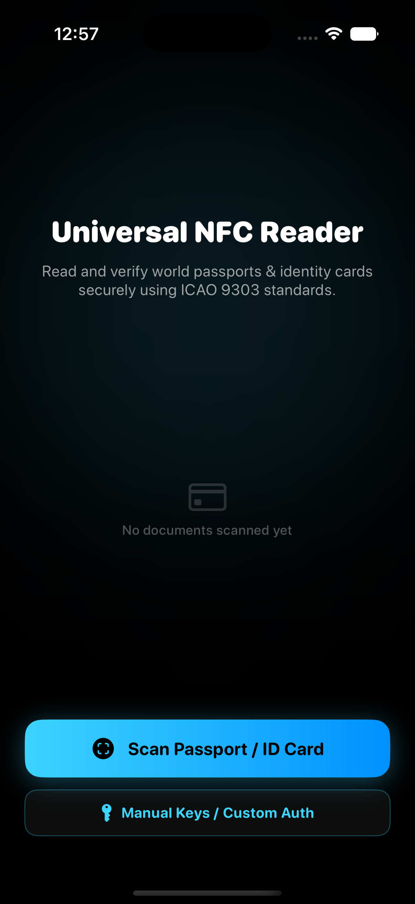
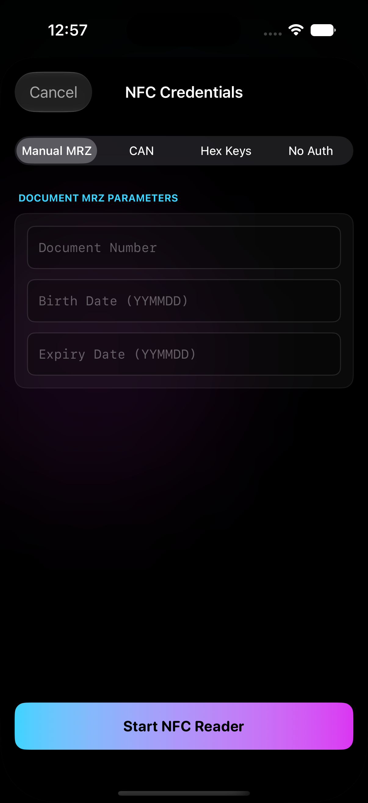

# UniversalPassportReader iOS Framework

[](https://github.com/aayushkumar20/NFC_Reader_iOS/actions/workflows/ci.yml)
[](https://github.com/aayushkumar20/NFC_Reader_iOS/actions/workflows/codeql.yml)



A premium, production-grade iOS framework built from scratch with **zero external dependencies** to read and verify NFC-enabled electronic passports (ePassports) and identity cards (eIDs) from all over the world. 

It implements the Machine Readable Travel Document (MRTD) standard defined by the **International Civil Aviation Organization (ICAO Doc 9303)**.

---

## 🏛️ Architecture Overview

The library employs a hybrid architecture, combining the portability, speed, and safety of C++ for core cryptographic and data parsing algorithms with modern Swift/SwiftUI for platform integration, camera OCR scanning, and premium haptic HUDs.

```
                  ┌──────────────────────────────┐
                  │      iOS Client App          │
                  └──────────────┬───────────────┘
                                 │ Links & Embeds
                  ┌──────────────▼───────────────┐
                  │ UniversalPassportReader.     │  SwiftUI HUD views, Camera OCR
                  │          xcframework         │  & CoreNFC tag handlers
                  └──────────────┬───────────────┘
                                 │ Swift-to-C Bridging Interface
                  ┌──────────────▼───────────────┐
                  │   UniversalPassportReader    │  High-performance C++ engine
                  │          C++ Core            │  handling BAC & ASN.1 / TLV
                  └──────────────────────────────┘
```

### 1. High-Performance C++ Core Engine
Located under `UniversalPassportReader/Sources/UniversalPassportReader/`:
* **`Crypto/PassportCrypto` ([.hpp](UniversalPassportReader/Sources/UniversalPassportReader/Crypto/PassportCrypto.hpp) / [.cpp](UniversalPassportReader/Sources/UniversalPassportReader/Crypto/PassportCrypto.cpp))**:
  * **Basic Access Control (BAC)**: Key derivation function (KDF) using SHA-1 hashing of the document number, birth date, and expiry date.
  * **Mutual Authentication**: Handshake matching ICAO specifications. Uses Triple-DES CBC mode for challenge encryption and ISO 9797-1 MAC Algorithm 3 (Retail MAC) for checksum integrity.
  * **Secure Messaging**: ISO 7816-4 secure transmission wrapper keeping track of the 8-byte Send Sequence Counter (SSC).
* **`NFC/ASN1Parser` ([.hpp](UniversalPassportReader/Sources/UniversalPassportReader/NFC/ASN1Parser.hpp) / [.cpp](UniversalPassportReader/Sources/UniversalPassportReader/NFC/ASN1Parser.cpp))**:
  * **BER-TLV Parsing**: Native Tag-Length-Value decoder capable of reading short and long form ASN.1 structures recursively.
  * **Biometric Extractor**: Scans files for standard magic image headers (`FF D8 FF` for JPEG, and JPEG 2000 headers) to isolate raw biometric face photos.
* **`UniversalPassportReaderCore` ([.h](UniversalPassportReader/Sources/UniversalPassportReader/UniversalPassportReaderCore.h) / [.cpp](UniversalPassportReader/Sources/UniversalPassportReader/UniversalPassportReaderCore.cpp))**:
  * Provides C-linkage APIs to bridge C++ objects directly to Swift without requiring complex Objective-C++ files.

### 2. Native Swift Platform Layer
* **`MRZ/MRZScanner` & `MRZParser`**: Camera session capturing (`AVCaptureSession`) feeding frames into Apple's `Vision` API to OCR read standard machine-readable lines:
  * **TD3**: 2 lines of 44 characters (Passports & Large Cards).
  * **TD1**: 3 lines of 30 characters (Standard ID Cards).
  * **TD2**: 2 lines of 36 characters (Visas & Identity Cards).
  * *Note: The prefix check (such as strict "P" matching for TD3) has been removed to support any document prefix worldwide.*
* **`NFC/PassportNFCReader`**: Coordinates `NFCTagReaderSession` from CoreNFC, triggers BAC mutual authentication via C++ bridging, and downloads `EF.DG1` and `EF.DG2` data groups. Supports custom credentials via `PassportAuthKey`.
* **`UI Overlay`**: High-fidelity glassmorphic camera aligned boxes, haptic triggers, pulsing NFC circular loaders, and a details dashboard.

---

## 🔐 Custom Authentication Credentials

Developers can feed custom authentication configurations using the `PassportAuthKey` enum in `PassportNFCReader`:

```swift
public enum PassportAuthKey: Hashable {
    case mrz(documentNumber: String, birthDateString: String, expiryDateString: String)
    case customHex(kEncHex: String, kMacHex: String)
    case can(String)
    case none
}
```

### Usage Options:
* **`mrz`**: Standard BAC key derivation using the document number, birth date, and expiry date strings.
* **`can`**: Derives keys from a 6-digit Card Access Number (CAN) printed on the front of ID cards.
* **`customHex`**: Supply arbitrary 16-byte raw session keys directly as hexadecimal strings (`kEnc` and `kMac`).
* **`none`**: Bypasses the mutual authentication handshake and initiates plain, unencrypted ISO-7816 file reads.

### UI Integration Screenshot:


### Opening the Scanner view with Custom Keys:

```swift
import SwiftUI
import UniversalPassportReader

struct ContentView: View {
    @State private var showingScanner = false
    
    // Example: Initiate direct NFC scan with a custom CAN key
    let customKey = PassportAuthKey.can("123456")
    
    var body: some View {
        Button("Start Custom CAN Scan") {
            showingScanner = true
        }
        .fullScreenCover(isPresented: $showingScanner) {
            PassportScannerView(authKey: customKey, onScanCompleted: { doc in
                print("Document Scanned: \(doc.firstName)")
            }, onDismiss: {
                showingScanner = false
            })
        }
    }
}
```

---

## 🛠️ Developer Guide & Making Changes

When updating or making modifications to the framework code, developers should follow these steps to ensure everything compiles and links correctly:

1. **Modify Source Files**: Change code in `UniversalPassportReader/Sources/UniversalPassportReader/`.
2. **Rebuild the XCFramework**: The demo app links to the packaged xcframework in the root directory. To compile your updates and refresh the xcframework, run the helper script:
   ```bash
   ./build_xcframework.sh
   ```
3. **Verify locally**: Build the client app target `PassportReaderDemo` inside Xcode.

---

## ⏱️ Benchmarking & Performance Stats

A standalone benchmarking script [benchmark.swift](benchmark.swift) is included to measure the execution time of the low-level C++ cryptographic engine and key derivation algorithms.

### Run Benchmarks Locally:
```bash
# Compile and run the benchmarks
swiftc -o run_benchmarks benchmark.swift UniversalPassportReader/Sources/UniversalPassportReader/UniversalPassportReaderCore.cpp UniversalPassportReader/Sources/UniversalPassportReader/Crypto/PassportCrypto.cpp UniversalPassportReader/Sources/UniversalPassportReader/NFC/ASN1Parser.cpp -lc++ -I UniversalPassportReader/Sources/UniversalPassportReader/
./run_benchmarks
```

### Execution Results (Apple Silicon M-series):
```
┌────────────────────────────────────────────────────────────────────────────────────────┐
│                      UniversalPassportReader Core Engine Benchmark                     │
├────────────────────────────────┬────────────┬────────────────┬─────────────────────────┤
│ Benchmark Operation            │ Iterations │ Total Time     │ Time/Iteration          │
├────────────────────────────────┼────────────┼────────────────┼─────────────────────────┤
│ BAC Key Derivation (KDF)       │       5000 │        0.0590 s │        0.011805 ms │
│ MRZ Check Digit Calculation    │      20000 │        0.0201 s │        0.001006 ms │
│ Retail MAC Computation (1KB)   │       1000 │        0.0688 s │        0.068844 ms │
│ 3DES CBC Encryption (2KB)      │       1000 │        0.1146 s │        0.114643 ms │
└────────────────────────────────┴────────────┴────────────────┴─────────────────────────┘
```

---

## 🚀 GitHub Actions CI & Security Pipeline

Two continuous integration workflows are configured under `.github/workflows/`:

### 1. Build, Test, and Performance Validation (`ci.yml`)
Runs on every push or pull request to check:
* **Code Quality**: Executes `swiftlint` to verify code-correctness and style compliance.
* **Unit Testing**: Installs `xcodegen`, generates the Xcode framework structure, and executes the suite of **14 Unit Tests** (checking lenient parsed MRZ, hex converters, key derivations, check digit calculations) on the iOS Simulator target.
* **Compilation**: Compiles the framework, packages the xcframework bundle, and builds the demo app target.
* **Regression Check**: Automatically compiles and executes the core benchmarking utility to verify no logic or execution speed regressions were introduced.

### 2. CodeQL Security Vulnerability Scan (`codeql.yml`)
GitHub's automated security analysis database scans the repository weekly and on updates:
* **Languages**: Scans both C++ and Swift targets.
* **Audit Levels**: Performed at `security-extended` and `security-and-quality` rulesets to detect potential buffer overflows, memory allocation issues, or insecure cryptographic configurations.


---

## 📱 Client App Setup & Integration

You can integrate the library using one of the following methods:

### Method 1: CocoaPods Integration (Recommended)
Add the pod specification targeting the repository source to your `Podfile`:

```ruby
target 'YourAppTarget' do
  use_frameworks!
  
  # Point directly to the git repository
  pod 'UniversalPassportReader', :git => 'https://github.com/aayushkumar20/NFC_Reader_iOS.git', :tag => 'v1.0.0'
end
```
Run `pod install` in the terminal to retrieve and configure the package bundle.

### Method 2: Manual XCFramework Integration
1. Download the compiled `UniversalPassportReader.xcframework` archive from the latest GitHub Release.
2. Drag `UniversalPassportReader.xcframework` into your project target's **Frameworks, Libraries, and Embedded Content** section.
3. Choose **Embed & Sign**.

### Method 3: Direct Swift Package Manager (SPM)
- Select **File -> Add Packages...** and add the repository URL `https://github.com/aayushkumar20/NFC_Reader_iOS.git` to fetch compilation schemas.

---

### Platform Permissions & Capabilities
Enable the **Near Field Communication Tag Reading** capability under project signing options and add the following keys to your application target's `Info.plist`:

```xml
<key>NSCameraUsageDescription</key>
<string>We need camera access to OCR scan the document's MRZ details.</string>

<key>NFCReaderUsageDescription</key>
<string>We need NFC access to scan the identity chip inside the card.</string>

<key>com.apple.developer.nfc.readersession.iso7816.select-identifiers</key>
<array>
    <string>A0000002471001</string>
    <string>A0000002472001</string>
</array>
```

---

## 📜 Standard References

* **ICAO Doc 9303 Part 11**: Specifies security protocols, BAC mutual authentication handshake, KDF, and session keys derivation parameters.
* **ISO 7816-4**: Defines commands for smart card operations (`SELECT FILE`, `READ BINARY`) and standard secure messaging wrappers.
* **ISO 9797-1**: Specifies message authentication check calculations (Retail MAC / MAC Algorithm 3).
